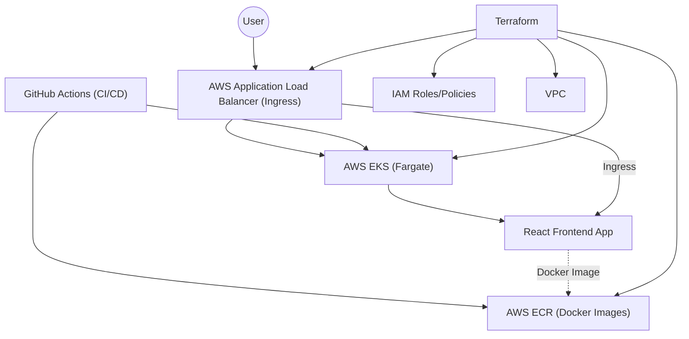

# Windsurf Infra Demo

This repository contains infrastructure-as-code for deploying a highly available React frontend on AWS EKS using Fargate, with CI/CD via GitHub Actions and automated ALB (AWS Application Load Balancer) integration.

## Architecture



## Features
- AWS EKS (Fargate) cluster managed with Terraform
- React frontend deployed via Helm
- AWS Load Balancer Controller (ALB Ingress) for public access
- CI/CD pipeline with GitHub Actions
- Secure IAM roles and policies for automation and controllers

## Getting Started

### Prerequisites
- AWS CLI and credentials (with permissions for EKS, IAM, and VPC)
- Terraform
- kubectl
- Helm

### Infrastructure Deployment
1. **Clone the repository:**
   ```sh
   git clone https://github.com/neilpricetw/windsurf-infra-demo.git
   cd windsurf-infra-demo
   ```
2. **Initialize and apply Terraform:**
   ```sh
   cd terraform-eks
   terraform init
   terraform apply
   ```
   Repeat in `terraform_backend` if IAM roles/policies are updated.

3. **Update your kubeconfig:**
   ```sh
   aws eks update-kubeconfig --region ap-southeast-2 --name np-eks-fargate
   ```

### Deploying the React Frontend
1. **Build and push Docker image** (automated via GitHub Actions, or manually):
   ```sh
   cd react-frontend/app
   docker build -t <your-ecr-repo>:<tag> .
   docker push <your-ecr-repo>:<tag>
   ```
2. **Deploy via Helm:**
   ```sh
   helm upgrade --install react-frontend ./react-frontend/chart --namespace default --create-namespace
   ```

### AWS Load Balancer Controller (ALB Ingress)
- The AWS Load Balancer Controller is deployed via Helm in the `kube-system` namespace and uses IRSA (IAM Roles for Service Accounts) for permissions.
- The required IAM policy for the controller is managed in Terraform (`terraform-eks/alb_policy.json`).

#### ⚠️ Manual Step: Helm ALB Controller
After applying Terraform, you must manually (re)deploy the AWS Load Balancer Controller with Helm:

```sh
helm upgrade -i aws-load-balancer-controller eks/aws-load-balancer-controller \
  -n kube-system \
  --set clusterName=np-eks-fargate \
  --set region=ap-southeast-2 \
  --set vpcId=<your-vpc-id> \
  --set serviceAccount.create=false \
  --set serviceAccount.name=aws-load-balancer-controller
```

This step is required because Helm manages the controller deployment and must be run after the IAM role and ServiceAccount are provisioned by Terraform.

## Troubleshooting
- **Pods Pending:** Ensure Fargate profiles match pod namespaces and labels.
- **ALB not routing traffic:** Check IAM permissions for the ALB controller role, and verify Service/Ingress configuration.
- **Ingress 404:** Ensure target groups and listeners are created and pods are healthy.

## License
MIT
